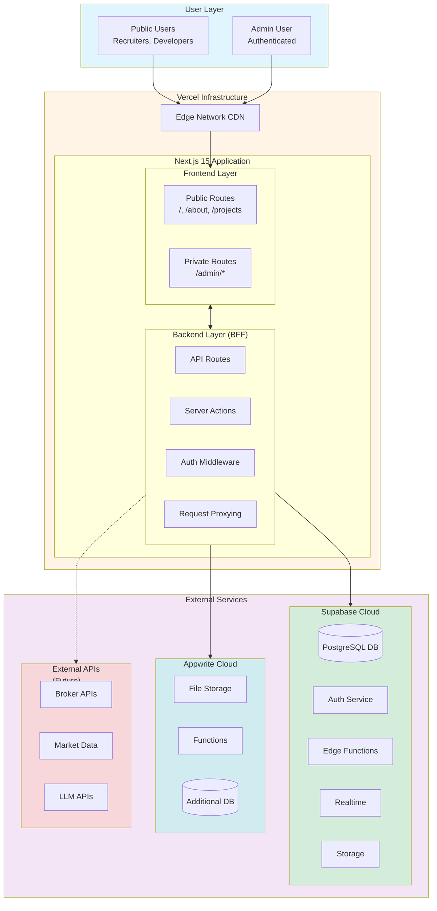
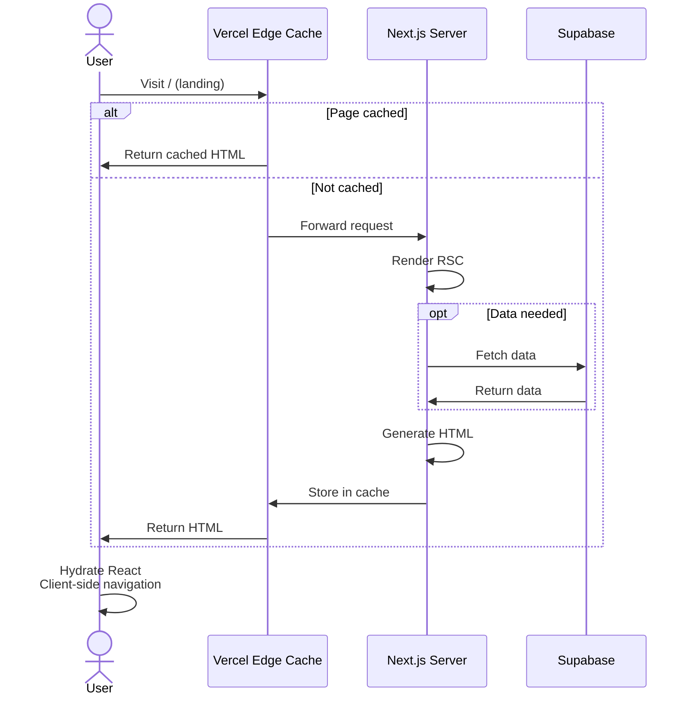
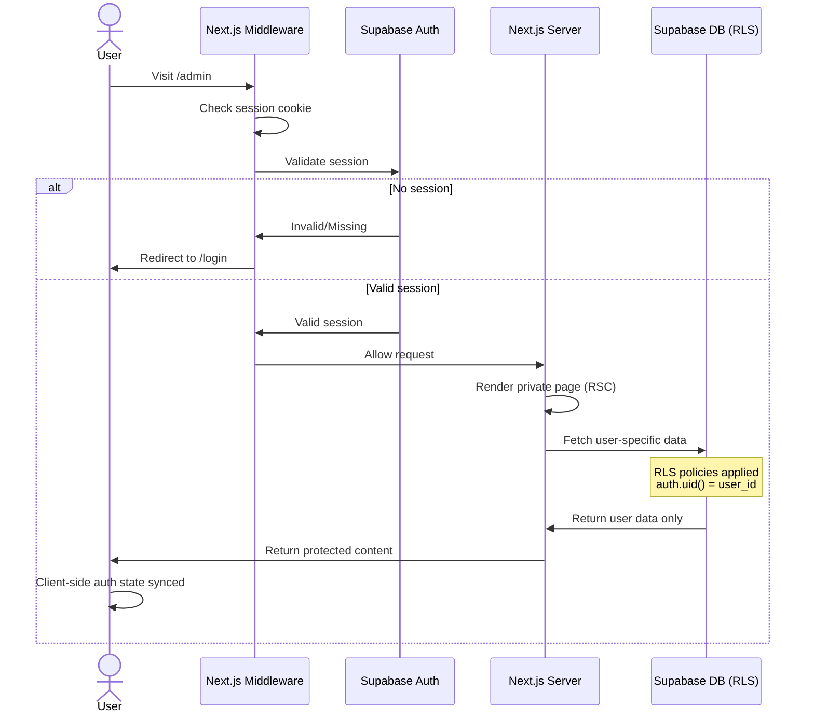
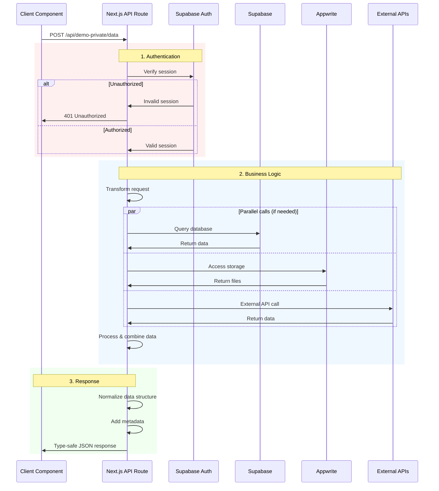
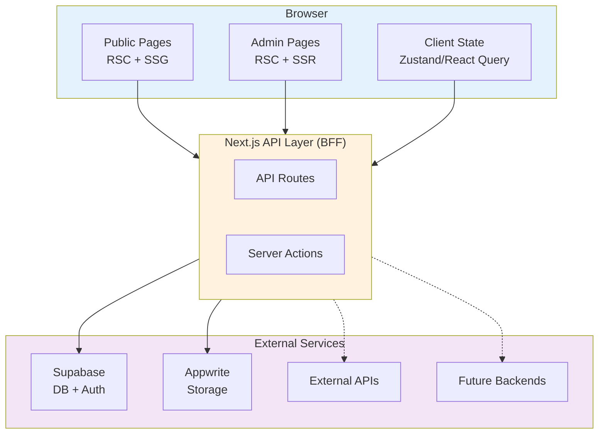
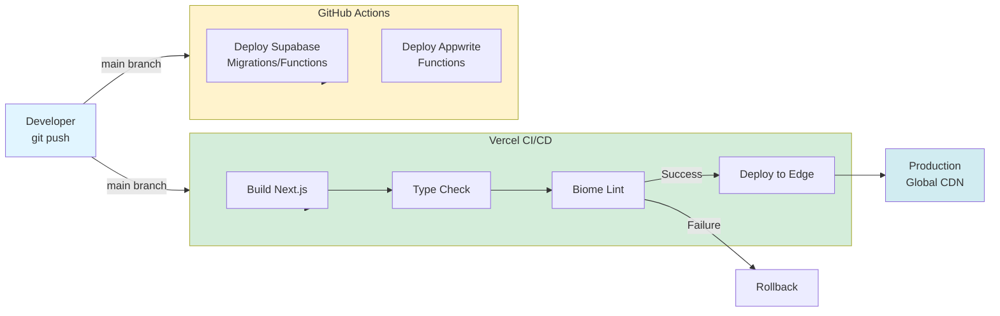

# System Architecture Document
## Portfolio Platform

**Document Version:** 1.0
**Date:** 2025-01-04
**Status:** Draft - Awaiting Review
**Owner:** Bikesh Rana

---

## 1. Architecture Overview

### 1.1 High-Level Architecture



### 1.2 Architecture Patterns

This platform follows several key architectural patterns:

1. **Backend for Frontend (BFF)**: Next.js API layer proxies all external service calls
2. **Server-Side Rendering (SSR)**: React Server Components for initial page loads
3. **JAMstack**: Static generation where possible, dynamic where needed
4. **Serverless-First**: Prefer serverless functions over dedicated servers
5. **Modular Monolith**: Single codebase with clear module boundaries
6. **Route-Based Architecture**: Features organized by route structure

### 1.3 Design Decisions

#### Why Next.js 15 App Router?
- **React Server Components**: Reduced client bundle, better performance
- **Server Actions**: Type-safe server mutations without API routes
- **File-based Routing**: Convention over configuration
- **Edge Runtime**: Global performance via Vercel edge network
- **Built-in Optimization**: Image optimization, font loading, etc.

#### Why Serverless Over Dedicated Servers?
- **Cost**: Free tiers sufficient for expected traffic
- **Scalability**: Auto-scales with demand
- **Maintenance**: No server management overhead
- **Cold Starts**: Acceptable for low-traffic application
- **Flexibility**: Can add dedicated services later if needed

#### Why Multiple Platforms (Supabase + Appwrite)?
- **Skill Showcase**: Demonstrates ability to integrate multiple services
- **Platform Diversity**: Avoid single vendor lock-in
- **Complementary Strengths**: Supabase for DB, Appwrite for multi-language functions
- **Free Tier Stacking**: More resources by combining free tiers
- **Learning Opportunity**: Hands-on experience with both platforms

---

## 2. System Components

### 2.1 Frontend Layer

#### 2.1.1 Technology Stack
- **Framework**: Next.js 15.1+ (App Router)
- **Language**: TypeScript 5.3+ (strict mode)
- **UI Library**: React 19+
- **Styling**: Tailwind CSS 3.4+
- **Components**: shadcn/ui (Radix UI primitives + Tailwind)
- **Icons**: Lucide React
- **Fonts**: Next.js Font Optimization (Inter, Geist)

#### 2.1.2 Route Structure

```
app/
├── (public)/                    # Public route group (no auth required)
│   ├── layout.tsx               # Public layout (header, footer)
│   ├── page.tsx                 # Landing page (/)
│   ├── about/
│   │   └── page.tsx             # About page (/about)
│   ├── projects/
│   │   ├── page.tsx             # Projects listing (/projects)
│   │   └── [slug]/
│   │       └── page.tsx         # Individual project (/projects/demo-app)
│   └── contact/
│       └── page.tsx             # Contact page (/contact)
│
├── (private)/                   # Private route group (auth required)
│   ├── layout.tsx               # Admin layout (sidebar, auth guard)
│   ├── admin/
│   │   └── page.tsx             # Admin home (/admin)
│   │
│   ├── demo-private/            # Dummy private project
│   │   ├── page.tsx             # (/admin/demo-private)
│   │   └── _components/
│   │       └── DemoComponent.tsx
│   │
│   └── [future-projects]/       # Additional projects added here
│
├── login/
│   └── page.tsx                 # Login page (/login)
│
└── layout.tsx                   # Root layout (theme, metadata)
```

#### 2.1.3 State Management Strategy

| State Type | Solution | Use Case |
|------------|----------|----------|
| **Local Component State** | `useState`, `useReducer` | Form inputs, UI toggles, temporary data |
| **Global Client State** | Zustand | Auth state, theme preferences, cross-component data |
| **Server State** | TanStack Query (React Query) | API data, caching, background refetching |
| **Form State** | React Hook Form | Complex forms with validation |
| **URL State** | Next.js `useSearchParams` | Filters, pagination, shareable state |
| **Server Component State** | Direct data fetching | Initial page data, SEO-critical content |

#### 2.1.4 Component Architecture

```
components/
├── ui/                          # shadcn/ui primitives (button, card, etc.)
│   ├── button.tsx
│   ├── card.tsx
│   ├── input.tsx
│   └── ...
│
├── layout/                      # Layout components
│   ├── Header.tsx               # Public header
│   ├── Footer.tsx               # Public footer
│   ├── Sidebar.tsx              # Admin sidebar
│   └── AdminNav.tsx             # Admin navigation
│
├── auth/                        # Auth-related components
│   ├── AuthGuard.tsx            # Client-side auth protection
│   ├── LoginForm.tsx
│   └── LogoutButton.tsx
│
└── shared/                      # Shared components across projects
    ├── LoadingSpinner.tsx
    ├── ErrorBoundary.tsx
    └── PageHeader.tsx
```

---

### 2.2 Backend Layer (BFF)

#### 2.2.1 Backend for Frontend Pattern

The Next.js backend serves as a Backend for Frontend (BFF), providing:

1. **API Gateway**: Single entry point for all external service calls
2. **Authentication Middleware**: Centralized auth checking
3. **Request/Response Transformation**: Adapt external APIs to frontend needs
4. **Rate Limiting**: Protect external service quotas
5. **Error Handling**: Standardized error responses
6. **Type Safety**: End-to-end TypeScript from frontend to backend

#### 2.2.2 API Route Structure

```
app/api/
├── auth/
│   ├── login/
│   │   └── route.ts             # POST /api/auth/login
│   ├── logout/
│   │   └── route.ts             # POST /api/auth/logout
│   └── session/
│       └── route.ts             # GET /api/auth/session
│
├── demo-private/                # Dummy private project API
│   └── data/
│       └── route.ts             # GET/POST /api/demo-private/data
│
└── [future-project-apis]/       # Project-specific API routes
```

#### 2.2.3 Server Actions

Server Actions replace API routes for mutations where appropriate:

```typescript
// Example: app/(private)/demo-private/actions.ts
'use server'

import { createClient } from '@/lib/supabase/server'
import { revalidatePath } from 'next/cache'

export async function updateDemoData(formData: FormData) {
  const supabase = createClient()

  // Auth check
  const { data: { user } } = await supabase.auth.getUser()
  if (!user) throw new Error('Unauthorized')

  // Business logic
  const result = await supabase
    .from('demo_data')
    .update({ ... })
    .eq('user_id', user.id)

  // Revalidate cache
  revalidatePath('/admin/demo-private')

  return result
}
```

**When to use Server Actions vs API Routes:**

| Use Server Actions | Use API Routes |
|-------------------|----------------|
| Form submissions | External API calls (webhooks) |
| Database mutations from RSC | Public endpoints |
| File uploads to Supabase/Appwrite | Third-party integrations |
| Simple CRUD operations | Complex multi-step operations |
| Type-safe RPC-style calls | REST/GraphQL endpoints |

---

### 2.3 Authentication & Authorization

#### 2.3.1 Supabase Auth Integration

**Authentication Flow:**

```
1. User visits /admin/* route
2. Middleware checks for session cookie
3. If no session → redirect to /login
4. User submits credentials
5. Next.js calls Supabase Auth API
6. Supabase returns JWT + refresh token
7. Tokens stored in httpOnly cookies
8. User redirected to /admin
9. Subsequent requests include cookie
10. Middleware validates session on each request
```

**Implementation:**

```typescript
// lib/supabase/server.ts
import { createServerClient } from '@supabase/ssr'
import { cookies } from 'next/headers'

export function createClient() {
  const cookieStore = cookies()

  return createServerClient(
    process.env.NEXT_PUBLIC_SUPABASE_URL!,
    process.env.NEXT_PUBLIC_SUPABASE_ANON_KEY!,
    {
      cookies: {
        get(name: string) {
          return cookieStore.get(name)?.value
        },
        set(name: string, value: string, options) {
          cookieStore.set({ name, value, ...options })
        },
        remove(name: string, options) {
          cookieStore.set({ name, value: '', ...options })
        },
      },
    }
  )
}
```

#### 2.3.2 Route Protection

**Middleware-based protection:**

```typescript
// middleware.ts
import { createServerClient } from '@supabase/ssr'
import { NextResponse } from 'next/server'
import type { NextRequest } from 'next/server'

export async function middleware(request: NextRequest) {
  const { pathname } = request.nextUrl

  // Check if route requires auth
  if (pathname.startsWith('/admin')) {
    const supabase = createServerClient(...)
    const { data: { session } } = await supabase.auth.getSession()

    if (!session) {
      return NextResponse.redirect(new URL('/login', request.url))
    }
  }

  return NextResponse.next()
}

export const config = {
  matcher: ['/admin/:path*']
}
```

#### 2.3.3 Row Level Security (RLS)

All Supabase tables use RLS policies to enforce data isolation:

```sql
-- Example: Demo private project data
CREATE TABLE demo_data (
  id UUID PRIMARY KEY DEFAULT gen_random_uuid(),
  user_id UUID REFERENCES auth.users(id),
  content TEXT,
  created_at TIMESTAMPTZ DEFAULT NOW()
);

-- Enable RLS
ALTER TABLE demo_data ENABLE ROW LEVEL SECURITY;

-- Policy: Users can only access their own data
CREATE POLICY "Users can CRUD own data"
  ON demo_data
  FOR ALL
  USING (auth.uid() = user_id)
  WITH CHECK (auth.uid() = user_id);
```

---

### 2.4 Database Architecture

#### 2.4.1 Supabase PostgreSQL

**Primary database for:**
- User authentication (managed by Supabase Auth)
- Application data (project-specific tables)
- Relational data requiring complex queries
- Data requiring real-time subscriptions (future)

**Naming Conventions:**
- Tables: `snake_case` (e.g., `portfolio_positions`)
- Columns: `snake_case`
- Primary keys: `id` (UUID)
- Foreign keys: `{table}_id` (e.g., `user_id`)
- Timestamps: `created_at`, `updated_at`

**Project-specific table namespacing:**
```
demo_private_data           # Dummy private project
portfolio_positions         # Investment portfolio (future)
portfolio_transactions      # Investment portfolio (future)
```

#### 2.4.2 Migration Strategy

**Using Supabase CLI:**

```bash
# Initialize Supabase locally
supabase init

# Create migration
supabase migration new create_demo_tables

# Edit migration file: supabase/migrations/YYYYMMDDHHMMSS_create_demo_tables.sql

# Apply migration locally
supabase db reset

# Deploy to production
supabase db push
```

**Migration CI/CD:**
- Migrations stored in `/supabase/migrations/`
- Linked to GitHub repo
- Auto-apply on push to `main` (via GitHub Actions)

#### 2.4.3 Appwrite Database (Optional)

**Used for:**
- Non-relational data
- Project-specific NoSQL needs (future)
- Alternative to Supabase for specific use cases

**Not used in MVP** - reserved for future projects requiring NoSQL or multi-language function direct DB access.

---

### 2.5 Serverless Functions

#### 2.5.1 Supabase Edge Functions

**Technology:**
- Runtime: Deno
- Language: TypeScript
- Deployment: Supabase CLI or GitHub Actions

**Use Cases:**
- Database-heavy operations
- Complex queries not suitable for client-side
- Scheduled tasks (future - via pg_cron)
- Webhooks requiring Supabase data

**Example Structure:**
```
supabase/functions/
├── demo-analysis/           # Example function
│   ├── index.ts
│   └── README.md
└── _shared/                 # Shared utilities
    └── supabaseClient.ts
```

**Invocation from Next.js:**
```typescript
// app/api/demo-private/analyze/route.ts
import { createClient } from '@/lib/supabase/server'

export async function POST(request: Request) {
  const supabase = createClient()

  const { data, error } = await supabase.functions.invoke('demo-analysis', {
    body: { ... }
  })

  return Response.json(data)
}
```

#### 2.5.2 Appwrite Functions

**Technology:**
- Runtime: Multiple (Node.js, Python, Go, Rust, etc.)
- Deployment: Appwrite CLI or GitHub Actions

**Use Cases:**
- Compute-heavy operations (ML, image processing)
- Multi-language requirements (Python for ML, Go for performance)
- File processing (integrated with Appwrite Storage)

**Example Structure:**
```
appwrite/functions/
├── image-processor/         # Example Node.js function
│   ├── index.js
│   └── package.json
└── ml-analyzer/             # Example Python function
    ├── main.py
    └── requirements.txt
```

**Not used in MVP** - reserved for future projects.

---

### 2.6 File Storage

#### 2.6.1 Appwrite Storage

**Primary storage for:**
- User-uploaded files
- Project assets (images, documents, videos)
- Generated reports/exports (future)

**Bucket Strategy:**
```
portfolio-public/            # Public assets (project screenshots, etc.)
portfolio-private/           # Private user files (admin only)
[project-name]-assets/       # Project-specific storage
```

**Access Control:**
- Public buckets: Read-only for all
- Private buckets: RLS-equivalent via Appwrite permissions

#### 2.6.2 Supabase Storage (Backup)

**Used for:**
- Database backups (automatic)
- Small files tightly coupled with database records
- Alternative if Appwrite storage limits reached

**Not primary storage in MVP** to showcase multi-platform integration.

---

### 2.7 Deployment Architecture

#### 2.7.1 Vercel Deployment

**Configuration:**
```json
// vercel.json
{
  "buildCommand": "npm run build",
  "devCommand": "npm run dev",
  "installCommand": "npm install",
  "framework": "nextjs",
  "regions": ["iad1"],  // Washington DC (closest to Supabase US East)
  "env": {
    "NEXT_PUBLIC_SUPABASE_URL": "@supabase-url",
    "NEXT_PUBLIC_SUPABASE_ANON_KEY": "@supabase-anon-key",
    "SUPABASE_SERVICE_ROLE_KEY": "@supabase-service-key",
    "NEXT_PUBLIC_APPWRITE_ENDPOINT": "@appwrite-endpoint",
    "NEXT_PUBLIC_APPWRITE_PROJECT": "@appwrite-project"
  }
}
```

**Deployment Flow:**
```
1. Push to `main` branch
2. Vercel webhook triggered
3. Build Next.js application
4. Run type checking (tsc --noEmit)
5. Run Biome linting/formatting check
6. Build succeeds → deploy to production
7. Build fails → rollback to previous deployment
```

#### 2.7.2 Supabase Deployment

**Database Migrations:**
```yaml
# .github/workflows/supabase-deploy.yml
name: Deploy Supabase Migrations
on:
  push:
    branches: [main]
    paths:
      - 'supabase/migrations/**'

jobs:
  deploy:
    runs-on: ubuntu-latest
    steps:
      - uses: actions/checkout@v3
      - uses: supabase/setup-cli@v1
      - run: supabase db push
        env:
          SUPABASE_ACCESS_TOKEN: ${{ secrets.SUPABASE_ACCESS_TOKEN }}
          SUPABASE_DB_PASSWORD: ${{ secrets.SUPABASE_DB_PASSWORD }}
```

**Edge Functions:**
```yaml
# .github/workflows/supabase-functions.yml
name: Deploy Supabase Functions
on:
  push:
    branches: [main]
    paths:
      - 'supabase/functions/**'

jobs:
  deploy:
    runs-on: ubuntu-latest
    steps:
      - uses: actions/checkout@v3
      - uses: supabase/setup-cli@v1
      - run: supabase functions deploy
        env:
          SUPABASE_ACCESS_TOKEN: ${{ secrets.SUPABASE_ACCESS_TOKEN }}
```

#### 2.7.3 Appwrite Deployment

**Functions (when needed):**
```yaml
# .github/workflows/appwrite-deploy.yml
name: Deploy Appwrite Functions
on:
  push:
    branches: [main]
    paths:
      - 'appwrite/functions/**'

jobs:
  deploy:
    runs-on: ubuntu-latest
    steps:
      - uses: actions/checkout@v3
      - uses: appwrite/action-deploy@v1
        with:
          appwrite-endpoint: ${{ secrets.APPWRITE_ENDPOINT }}
          appwrite-project: ${{ secrets.APPWRITE_PROJECT }}
          appwrite-key: ${{ secrets.APPWRITE_API_KEY }}
```

---

## 3. Data Flow Diagrams

### 3.1 Public User Flow



### 3.2 Private User Flow (Authenticated)



### 3.3 API Request Flow (BFF Pattern)



---

## 4. Security Architecture

### 4.1 Authentication Security

| Layer | Mechanism | Implementation |
|-------|-----------|----------------|
| **Session Management** | httpOnly cookies | Supabase Auth SDK |
| **Token Storage** | Secure cookies (not localStorage) | Next.js cookie handling |
| **CSRF Protection** | SameSite cookie attribute | Next.js default |
| **Password Hashing** | bcrypt | Supabase Auth (managed) |
| **Rate Limiting** | Supabase Auth built-in | 30 attempts/hour default |

### 4.2 Authorization Security

| Layer | Mechanism | Implementation |
|-------|-----------|----------------|
| **Route Protection** | Middleware auth check | Custom Next.js middleware |
| **API Protection** | Session validation | Per-route auth check |
| **Database Security** | Row Level Security (RLS) | Supabase policies |
| **File Access** | Bucket permissions | Appwrite ACL |

### 4.3 Data Security

- **Encryption in Transit**: HTTPS enforced (Vercel, Supabase, Appwrite)
- **Encryption at Rest**: Platform-managed (Supabase, Appwrite)
- **Secrets Management**: Environment variables (Vercel, GitHub Secrets)
- **API Keys**: Never in client-side code, server-only
- **SQL Injection**: Prevented via parameterized queries (Supabase client)
- **XSS Prevention**: React automatic escaping + CSP headers

### 4.4 Content Security Policy

```typescript
// next.config.js
const securityHeaders = [
  {
    key: 'Content-Security-Policy',
    value: `
      default-src 'self';
      script-src 'self' 'unsafe-eval' 'unsafe-inline';
      style-src 'self' 'unsafe-inline';
      img-src 'self' data: https:;
      font-src 'self' data:;
      connect-src 'self' https://*.supabase.co https://*.appwrite.io;
    `.replace(/\s{2,}/g, ' ').trim()
  },
  {
    key: 'X-Frame-Options',
    value: 'DENY'
  },
  {
    key: 'X-Content-Type-Options',
    value: 'nosniff'
  },
  {
    key: 'Referrer-Policy',
    value: 'strict-origin-when-cross-origin'
  }
]
```

---

## 5. Performance Architecture

### 5.1 Rendering Strategy

| Route Type | Strategy | Reason |
|------------|----------|--------|
| `/` (Landing) | ISR (60s) | Balance freshness & performance |
| `/about` | Static | Rarely changes |
| `/projects` | Static | Pre-render at build time |
| `/projects/[slug]` | Static (generateStaticParams) | Pre-render all projects |
| `/admin/*` | Dynamic (SSR) | User-specific, always fresh |
| `/login` | Static | No dynamic data |

### 5.2 Caching Strategy

```
┌─────────────────────────────────────────────────────────────┐
│ Caching Layers (Fastest to Slowest)                         │
├─────────────────────────────────────────────────────────────┤
│                                                             │
│  1. Browser Cache (Client)                                 │
│     - Static assets: 1 year                                │
│     - API responses: No cache (private data)               │
│                                                             │
│  2. Vercel Edge Cache (CDN)                                │
│     - Static pages: Until revalidate                       │
│     - ISR pages: 60s (configurable)                        │
│     - Dynamic pages: No cache                              │
│                                                             │
│  3. React Query Cache (Client)                             │
│     - API data: 5 minutes default                          │
│     - Background refetch on window focus                   │
│                                                             │
│  4. Next.js Data Cache (Server)                            │
│     - fetch() requests: Automatic deduplication            │
│     - Revalidate per route configuration                   │
│                                                             │
│  5. Supabase Connection Pooling                            │
│     - Database connections: Pooled (Supavisor)             │
│                                                             │
└─────────────────────────────────────────────────────────────┘
```

### 5.3 Code Splitting

- **Route-based**: Automatic via Next.js App Router
- **Component-based**: Dynamic imports for heavy components
- **Project-based**: Each project's code isolated in separate chunks

```typescript
// Example: Lazy load heavy chart component
import dynamic from 'next/dynamic'

const HeavyChart = dynamic(
  () => import('@/components/HeavyChart'),
  { ssr: false, loading: () => <LoadingSpinner /> }
)
```

### 5.4 Image Optimization

- **Next.js Image Component**: Automatic WebP conversion, lazy loading
- **Responsive Images**: Automatic srcset generation
- **CDN Delivery**: Via Vercel edge network
- **Appwrite Storage**: Optimized delivery for user-uploaded images

---

## 6. Scalability Considerations

### 6.1 Current Scale (MVP)

| Resource | Expected | Limit | Headroom |
|----------|----------|-------|----------|
| **Monthly visitors** | 100-500 | Unlimited (Vercel) | ∞ |
| **Database size** | < 10MB | 500MB (Supabase free) | 50x |
| **Storage** | < 100MB | 2GB (Appwrite free) | 20x |
| **API requests** | < 10k/mo | 500k/mo (Supabase) | 50x |
| **Bandwidth** | < 10GB | 100GB (Vercel) | 10x |

### 6.2 Scaling Path (Future)

**If traffic grows beyond free tiers:**

1. **Vertical Scaling (Upgrade plans)**
   - Vercel Pro: $20/mo
   - Supabase Pro: $25/mo
   - Appwrite Pro: Pay-as-you-go

2. **Horizontal Scaling (Already built-in)**
   - Serverless auto-scales
   - Edge functions distribute globally
   - CDN handles traffic spikes

3. **Database Scaling**
   - Supabase read replicas (Pro tier)
   - Connection pooling (already enabled)
   - Indexed queries (designed from start)

4. **Backend Scaling**
   - Add dedicated services (Render, Koyeb) for heavy compute
   - Move to containerized deployments if needed
   - Keep BFF pattern to avoid frontend changes

---

## 7. Monitoring & Observability (Future)

**Not in MVP, but designed for easy addition:**

### 7.1 Logging
- **Platform-native**: Vercel logs, Supabase logs
- **Future**: Structured logging with Pino/Winston

### 7.2 Error Tracking
- **Future**: Sentry integration (React Error Boundary hooks ready)

### 7.3 Analytics
- **Future**: Plausible Analytics (privacy-focused, lightweight)

### 7.4 Performance Monitoring
- **Built-in**: Vercel Analytics (Web Vitals)
- **Future**: Custom RUM (Real User Monitoring)

---

## 8. Technology Decisions & Rationale

### 8.1 Frontend Decisions

| Decision | Alternative Considered | Rationale |
|----------|----------------------|-----------|
| **Next.js 15** | Remix, Astro, SvelteKit | Industry standard, best Vercel integration, RSC |
| **TypeScript** | JavaScript | Type safety, better DX, industry expectation |
| **Tailwind CSS** | CSS Modules, Styled Components | Fast development, small bundle, popular |
| **shadcn/ui** | MUI, Chakra, Mantine | Modern, customizable, no runtime JS, accessibility |
| **Zustand** | Redux, Context API | Lightweight, simple API, no boilerplate |
| **React Query** | SWR, Apollo | Feature-rich, better caching, DevTools |

### 8.2 Backend Decisions

| Decision | Alternative Considered | Rationale |
|----------|----------------------|-----------|
| **Next.js API Routes** | Separate Express server | Colocation, type sharing, Vercel optimization |
| **Supabase** | Firebase, PlanetScale | PostgreSQL (robust), generous free tier, RLS |
| **Appwrite** | AWS S3, Cloudinary | Multi-language functions, free storage, simplicity |
| **Serverless Functions** | Dedicated servers | Cost, scalability, maintenance, fits traffic |

### 8.3 DevOps Decisions

| Decision | Alternative Considered | Rationale |
|----------|----------------------|-----------|
| **Vercel** | Netlify, Cloudflare Pages | Best Next.js support, zero config, edge network |
| **GitHub Actions** | CircleCI, GitLab CI | Free, integrated, simple for this scale |
| **Biome.js** | ESLint + Prettier | Faster, single tool, modern, showcases new tech |

---

## 9. Constraints & Trade-offs

### 9.1 Architectural Constraints

| Constraint | Impact | Mitigation |
|------------|--------|------------|
| **Free tier limits** | Can't handle viral traffic | Monitor usage, upgrade if needed |
| **Single admin user** | No user management needed (simpler) | Easy to add later (Supabase Auth supports it) |
| **Serverless cold starts** | First request slower (300-500ms) | Acceptable for low traffic, can add warmup later |
| **No E2E tests in MVP** | Potential bugs in critical flows | Manual testing, add later as showcase |

### 9.2 Conscious Trade-offs

| Trade-off | Chosen | Reason |
|-----------|--------|--------|
| **Modularity vs Simplicity** | Modularity | Future extensibility more important |
| **Type safety vs Speed** | Type safety | Showcases engineering rigor |
| **Features vs Performance** | Performance | Demonstrates optimization skills |
| **DRY vs Explicit** | Explicit | Clarity over cleverness (easier for recruiters to read) |

---

## 10. Future Architecture Considerations

### 10.1 Planned Extensions (Post-MVP)

1. **Investment Portfolio Project**
   - Dedicated backend: Python FastAPI on Render
   - Real-time data: WebSocket connection to market data API
   - Heavy computation: Appwrite Python functions for analysis
   - Visualizations: D3.js/Recharts on frontend

2. **Real-time Features**
   - Supabase Realtime for live updates
   - Server-Sent Events for notifications

3. **AI/LLM Integration**
   - OpenAI API for portfolio analysis
   - Streaming responses via Server Actions

### 10.2 Potential Refactors

**If codebase grows significantly:**

- **Monorepo with Turborepo**: Separate packages for each project
- **Shared component library**: Extract common UI to separate package
- **GraphQL Gateway**: If multiple backends become complex to manage
- **Microservices**: If specific projects need independent scaling

**Decision point**: When 5+ projects or 50k+ LOC

---

## 11. Architecture Validation Checklist

- ✅ **Modularity**: Each project self-contained, minimal coupling
- ✅ **Scalability**: Serverless architecture scales automatically
- ✅ **Security**: Multi-layer auth, RLS, secure session management
- ✅ **Performance**: Edge caching, static generation, code splitting
- ✅ **Maintainability**: Type safety, clear structure, documented decisions
- ✅ **Cost**: Free tier for expected usage
- ✅ **Developer Experience**: Fast local dev, auto-formatting, type safety
- ✅ **Extensibility**: Easy to add projects, backends, features
- ✅ **Showcase Value**: Modern stack, best practices, multiple platforms

---

## 12. Architecture Diagrams Summary

### 12.1 Component Interaction



### 12.2 Deployment Pipeline



---

## 13. References & Resources

### 13.1 Official Documentation
- [Next.js 15 Docs](https://nextjs.org/docs)
- [Supabase Docs](https://supabase.com/docs)
- [Appwrite Docs](https://appwrite.io/docs)
- [Vercel Docs](https://vercel.com/docs)
- [React 19 Docs](https://react.dev)

### 13.2 Architecture Patterns
- [BFF Pattern](https://samnewman.io/patterns/architectural/bff/)
- [JAMstack](https://jamstack.org/)
- [Serverless Architectures](https://martinfowler.com/articles/serverless.html)

---

## 14. Approval & Next Steps

**Prepared By**: Claude (AI Assistant)
**Reviewed By**: Bikesh Rana
**Approval Status**: Pending Review
**Next Document**: Technical Specification Document

---

## Document History

| Version | Date | Author | Changes |
|---------|------|--------|---------|
| 1.0 | 2025-01-04 | Claude | Initial architecture design |

---

**END OF DOCUMENT**
