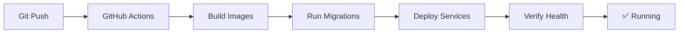

# Pi5 Trading System

**Production-Ready Algorithmic Trading System for Raspberry Pi**

Professional trading system with real-time market data, technical analysis, backtesting, risk management, and a modern web dashboard. Optimized for Raspberry Pi but runs on any ARM64/AMD64 system.

---

## 🚀 Quick Start (5 Minutes)

### Step 1: Setup Raspberry Pi (One-Time)

```bash
# SSH into your Raspberry Pi
ssh pi@YOUR_PI_IP

# Clone repository
cd ~
git clone https://github.com/BikeshR/menorepo.git
cd menorepo/projects/pi5-trading-system

# Run setup script (installs Docker + GitHub Runner)
chmod +x deployment/setup-pi.sh
./deployment/setup-pi.sh
```

**During setup you'll need:**
- GitHub repository token (script will show you where to get it)
- Alpaca API credentials (free at https://alpaca.markets)

### Step 2: Deploy with Git Push

```bash
# On your development machine
cd /path/to/menorepo
git push origin main
```

**Done!** GitHub Actions automatically deploys everything.

**Monitor:** https://github.com/YOUR_USERNAME/menorepo/actions

**Access Dashboard:** `http://YOUR_PI_IP:8080`

---

## ✨ What You Get

### Trading Features
- 📊 **Real-Time Data** - Alpaca Markets integration with IEX feed
- 📈 **Technical Indicators** - RSI, Bollinger Bands, VWAP, EMA, SMA
- 🎯 **Multiple Strategies** - Mean reversion, momentum, breakout
- 🔄 **Backtesting** - Test strategies on historical data
- ⚡ **Optimization** - Grid search, walk-forward, Monte Carlo
- 🛡️ **Risk Management** - Position sizing, portfolio limits, drawdown protection

### System Features
- 🐳 **Docker-Based** - One-command deployment, easy updates
- 🔄 **Auto-Deploy** - Push to git → automatic deployment
- 📱 **Web Dashboard** - React 19 interface with real-time updates
- 🗄️ **PostgreSQL** - Time-series optimized storage
- 💾 **Redis** - High-performance caching
- 📊 **Monitoring** - Resource usage, logs, health checks

---

## 📊 Architecture

### Production (Raspberry Pi)

```
GitHub Push → Self-Hosted Runner → Docker Compose → Running System
                                         ↓
                            ┌─────────────────────────┐
                            │ PostgreSQL 16           │
                            │ Redis 7                 │
                            │ Trading API + Dashboard │
                            └─────────────────────────┘
```

**Resource Usage:** ~500 MB RAM (6% of 8GB Pi)

### Development (Workstation)

```bash
docker-compose up -d        # Start databases + API
cd dashboard && npm run dev # Dashboard with hot reload
```

---

## 📚 Documentation

- **[Deployment Guide](deployment/README.md)** - Complete Pi deployment docs
- **[Development Guide](DEVELOPMENT.md)** - Local development setup
- **[Optimization Guide](docs/OPTIMIZATION_GUIDE.md)** - Backtesting & optimization
- **[Risk Management](docs/RISK_MANAGEMENT_GUIDE.md)** - Position sizing & limits

---

## 🎯 System Requirements

### Raspberry Pi (Production)
- **Model:** Pi 4 or 5 (4GB+ RAM, 8GB recommended)
- **Storage:** 32GB+ microSD or SSD
- **OS:** Ubuntu 24.04 or Raspberry Pi OS
- **Network:** Stable internet connection

### Development Machine
- **Docker & Docker Compose**
- **Node.js 18+** (for dashboard)
- **Go 1.21+** (optional, Docker handles it)

---

## 🛠️ Technology Stack

| Component | Technology |
|-----------|-----------|
| **Backend** | Go 1.21 (event-driven, 10k+ events/sec) |
| **Frontend** | React 19 + TypeScript + Vite |
| **Database** | PostgreSQL 16 (time-series optimized) |
| **Cache** | Redis 7 |
| **Deployment** | Docker + Docker Compose |
| **CI/CD** | GitHub Actions (self-hosted runner) |

---

## 🎮 Common Operations

```bash
# View system status
~/pi5-trading-system/monitor.sh

# View logs
docker-compose -f ~/menorepo/projects/pi5-trading-system/docker-compose.prod.yml logs -f

# Create backup
~/pi5-trading-system/backup.sh

# Update system (or just push to git)
~/pi5-trading-system/update.sh

# Run backtest
docker exec pi5-trading-api ./backtest -symbol SPY -strategy rsi_mean_reversion

# Optimize strategy
docker exec pi5-trading-api ./optimize -mode grid -symbol SPY
```

---

## 🔐 Security

⚠️ **Important:**
- Use paper trading URL: `https://paper-api.alpaca.markets`
- Set `TRADING_ENABLED=false` until thoroughly tested
- Change default passwords in `.env`
- Never commit `.env` to git
- Review [deployment/README.md](deployment/README.md#security) for hardening

---

## 📈 Features Explained

### Backtesting Engine
Test strategies on historical data with realistic simulation:
- Slippage modeling (0.1%)
- Commission tracking
- 20+ performance metrics (Sharpe, Sortino, Calmar, etc.)
- Trade-by-trade analysis

### Optimization Tools
Find optimal strategy parameters:
- **Grid Search** - Test all parameter combinations
- **Walk-Forward** - Prevent overfitting with out-of-sample testing
- **Monte Carlo** - Test robustness with 1000+ simulations

### Risk Management
Professional capital protection:
- **Position Sizing** - Kelly Criterion, Percent Risk, Volatility-Adjusted
- **Portfolio Limits** - Max drawdown (15%), daily loss ($3k), concurrent positions
- **Dynamic Allocation** - Equal weight, Sharpe-weighted, Risk parity, Adaptive Kelly

---

## 🔄 Automated Deployment Flow



Every push to `main`:
1. ✅ Creates database backup
2. ✅ Builds Docker images on Pi
3. ✅ Runs database migrations
4. ✅ Deploys updated services
5. ✅ Verifies deployment health
6. ✅ Cleans up old images

---

## 🛣️ Roadmap

### ✅ Completed
- Core trading engine with event bus
- Real-time market data (Alpaca IEX)
- Technical indicators (RSI, Bollinger, VWAP, etc.)
- Multiple trading strategies
- Backtesting framework
- Optimization tools (grid search, walk-forward, Monte Carlo)
- Risk & portfolio management
- Web dashboard
- Docker deployment
- GitHub Actions CI/CD

### 📋 Next Steps
- Machine learning strategies
- Multi-asset support (crypto, forex)
- Advanced order types
- Mobile app for monitoring
- Strategy marketplace

---

## ⚠️ Disclaimer

**For educational purposes only.** Trading involves substantial risk of loss. Past performance does not guarantee future results. Use at your own risk.

This system is designed for paper trading and simulation. Real money trading requires additional testing, regulatory compliance, and risk management.

---

## 🆘 Support

- **Quick Start:** [deployment/README.md](deployment/README.md)
- **Development:** [DEVELOPMENT.md](DEVELOPMENT.md)
- **Issues:** https://github.com/BikeshR/menorepo/issues
- **Strategies:** [docs/STRATEGIES.md](docs/STRATEGIES.md)

---

## 📄 License

MIT License - See LICENSE file for details

---

**Built with Go, React, PostgreSQL, Redis, and Docker** 🚀📈
